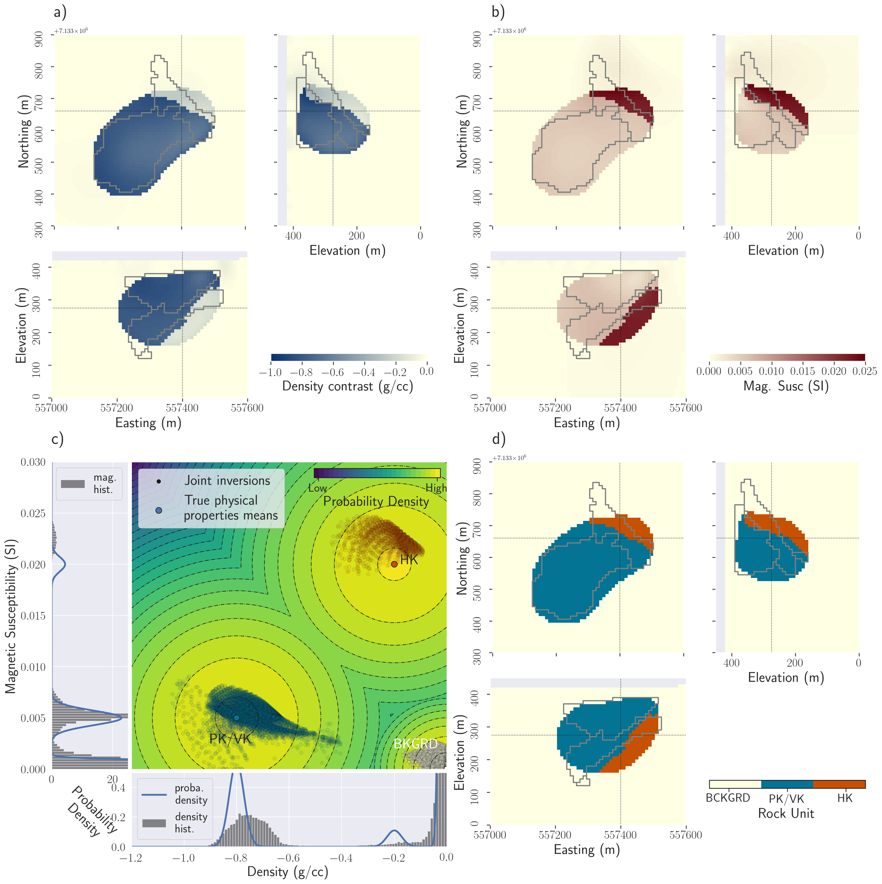

**[summary](#summary) | [contents](#contents) | [usage](#usage) | [running the notebooks](#running-the-notebooks) | [issues](#issues) | [citations](#citations) | [license](#license)**

# Joint inversion of synthetic potential fields data based on the DO-27 kimberlite pipe

[](https://zenodo.org/badge/latestdoi/227492402)

Python scripts and Jupyter notebooks for forward modeling and joint inversion of potential fields data using the PGI Framework (Astic & Oldenburg 2019; Astic et al. 2020) with [<tt>`SimPEG`</tt>](https://simpeg.xyz/). Examples published in Astic et al. 2020.



## Summary

We present a framework for petrophysically and geologically guided inversion to perform multi-physics joint inversions. Petrophysical and geological information is included in a multi-dimensional Gaussian mixture model that regularizes the inverse problem. The inverse problem we construct consists of a suite of three cyclic optimizations over the geophysical, petrophysical and geological information. The two additional problems over the petrophysical and geological data are used as a coupling term. They correspond to updating the geophysical reference model and regularization weights. This guides the inverse problem towards reproducing the desired petrophysical and geological characteristics. The objective function that we define for the inverse problem is comprised of multiple data misfit terms: one for each geophysical survey and one for the petrophysical properties and geological information. Each of these misfit terms has its own target misfit value which we seek to fit in the inversion. Our framework is modular and extensible and this allows us to combine multiple geophysical methods in a joint inversion and to distribute open-source code and reproducible examples. To illustrate the gains made by multi-physics inversions, we apply our framework to jointly invert, in 3D, synthetic potential fields data based on the DO-$27$ kimberlite pipe case study (Northwest Territories, Canada). The pipe contains two distinct kimberlite facies embedded in a host rock. We show that inverting the datasets individually, even with petrophysical information, leads to a binary geologic model consisting of background or kimberlite. A joint inversion, with petrophysical information, can differentiate the two main kimberlite facies of the pipe.

## Contents

- [Geology surfaces folder](/Geology_Surfaces): Geology surfaces built from drillholes

- [Forward folder](/Forward): Scripts to forward model the magnetic and gravity data from the geological surfaces

- [L2 inverion folder](/L2_inversion): Jupyter notebooks to run Tikhonov (L2) inversions and Sparse (Lp-Lq) inversion of the gravity and magnetic data.

- [Petrophysics folder](/Petrophysics): Jupyter notebook to build the GMM objects for all the PGI inversions.

- [PGI individual inversion](/PGI_individual_inversion): Jupyter notebooks to perform PGI inverions of the gravity and magnetic data individually, each with the PK and HK signature respectively.

- [PGI joint inversion](/PGI_joint_inversion): Jupyter notebook to perform the joint PGI inversion with full petrophysical knowledge

- [PGI Joint no petrophysical means](/PGI_Joint_no_petrophysical_means): Jupyter notebook to perform the joint PGI inversion without petrophysical knowledge

## Usage

Dependencies are specified in [requirements.txt](/requirements.txt)

```
pip install -r requirements.txt
```

To run the notebooks locally, you will need to have python installed,
preferably through [anaconda](https://www.anaconda.com/download/) .

You can then clone this repository. From a command line, run

```
git clone https://github.com/simpeg-research/Astic-2020-JointInversion.git
```

Then `cd` into the `Astic-2020-JointInversion` directory:

```
cd Astic-2020-JointInversion
```

To setup your software environment, we recommend you use the provided conda environment

```
conda env create -f environment.yml
conda activate pgijoint-environment
```


alternatively, you can install dependencies through pypi

```
pip install -r requirements.txt
```

You can then launch Jupyter

```
jupyter notebook
```

Jupyter will then launch in your web-browser.

## Running the notebooks

Each cell of code can be run with `shift + enter` or you can run the entire notebook by selecting `cell`, `Run All` in the toolbar.

For more information on running Jupyter notebooks, see the [Jupyter Documentation](https://jupyter.readthedocs.io/en/latest/)

## Issues

Please [make an issue](https://github.com/simpeg-research/Astic-2020-JointInversion/issues) if you encounter any problems while trying to run the notebooks.

## Citations

If you build upon or use these examples in your work, please cite:

Astic, T., L. J. Heagy, and D. W. Oldenburg, 2020, Joint geophysical, petrophysical and geologic inversion using a dynamic Gaussian mixture model, submitted to Geophysical Journal International.


Astic, T., and D. W. Oldenburg, 2019, A framework for petrophysically and geologically guided geophysical inversion using a dynamic Gaussian mixture model prior: Geophysical Journal International, 219, 1989-2012. https://doi.org/10.1093/gji/ggz389


Astic, T. and D. W. Oldenburg, 2018, Petrophysically guided geophysical inversion using a dynamic Gaussian mixture model prior. In SEG Technical Program Expanded Abstracts 2018 (pp. 2312-2316). https://doi.org/10.1190/segam2018-2995155.1


```
@article{AsticJoint,
author = {Thibaut Astic and Lindey J. Heagy and Douglas W. Oldenburg},
title = {Joint geophysical, petrophysical and geologic inversion using a dynamic Gaussian mixture model},
journal = {Submitted to Geophysical Journal International},
year = {2020}
}

@article{ggz389,
author = {Astic, Thibaut and Oldenburg, Douglas W},
title = "{A framework for petrophysically and geologically guided geophysical inversion using a dynamic Gaussian mixture model prior}",
journal = {Geophysical Journal International},
volume = {219},
number = {3},
pages = {1989-2012},
year = {2019},
month = {08},
issn = {0956-540X},
doi = {10.1093/gji/ggz389},
url = {https://doi.org/10.1093/gji/ggz389},
eprint = {http://oup.prod.sis.lan/gji/article-pdf/219/3/1989/30144784/ggz389.pdf},
}

@inbook{Astic2018,
author = {Thibaut Astic and Douglas W. Oldenburg},
title = {Petrophysically guided geophysical inversion using a dynamic Gaussian mixture model prior},
booktitle = {SEG Technical Program Expanded Abstracts 2018},
chapter = {},
pages = {2312-2316},
year = {2018},
doi = {10.1190/segam2018-2995155.1},
URL = {https://library.seg.org/doi/abs/10.1190/segam2018-2995155.1},
eprint = {https://library.seg.org/doi/pdf/10.1190/segam2018-2995155.1}
}
```

If you are using [<tt>`SimPEG`</tt>](https://simpeg.xyz/), please cite:

Cockett, Rowan, Seogi Kang, Lindsey J. Heagy, Adam Pidlisecky, and Douglas W. Oldenburg. "SimPEG: An Open Source Framework for Simulation and Gradient Based Parameter Estimation in Geophysical Applications" Computers & Geosciences, September 2015. https://doi.org/10.1016/j.cageo.2015.09.015.

```
@article{Cockett2015,
author = {Cockett, Rowan and Kang, Seogi and Heagy, Lindsey J. and Pidlisecky, Adam and Oldenburg, Douglas W.},
doi = {10.1016/j.cageo.2015.09.015},
issn = {00983004},
journal = {Computers and Geosciences},
keywords = {Electromagnetics,Geophysics,Inversion,Numerical modeling,Object-oriented programming,Sensitivities},
pages = {142--154},
publisher = {Elsevier},
title = {{SimPEG: An open source framework for simulation and gradient based parameter estimation in geophysical applications}},
url = {http://dx.doi.org/10.1016/j.cageo.2015.09.015},
volume = {85},
year = {2015}
}
```

If you are using the Electromagnetics Simulations & Inversions capabilities of [<tt>`SimPEG`</tt>](https://simpeg.xyz/), please cite:

Lindsey J. Heagy, Rowan Cockett, Seogi Kang, Gudni K. Rosenkjaer, Douglas W. Oldenburg. "A framework for simulation and inversion in electromagnetics" Computers & Geosciences, September 2017. https://doi.org/10.1016/j.cageo.2017.06.018

```
@article{heagy2017framework,
title = {A framework for simulation and inversion in electromagnetics},
journal = {Computers \& Geosciences},
volume = {107},
pages = {1-19},
year = {2017},
issn = {0098-3004},
doi = {https://doi.org/10.1016/j.cageo.2017.06.018},
url = {http://www.sciencedirect.com/science/article/pii/S0098300416303946},
author = {Lindsey J. Heagy and Rowan Cockett and Seogi Kang and Gudni K. Rosenkjaer and Douglas W. Oldenburg},
keywords = {Geophysics, Numerical modelling, Finite volume, Sensitivities, Object oriented}
}
```


## License
These notebooks are licensed under the [MIT License](/LICENSE) which allows academic and commercial re-use and adaptation of this work.
